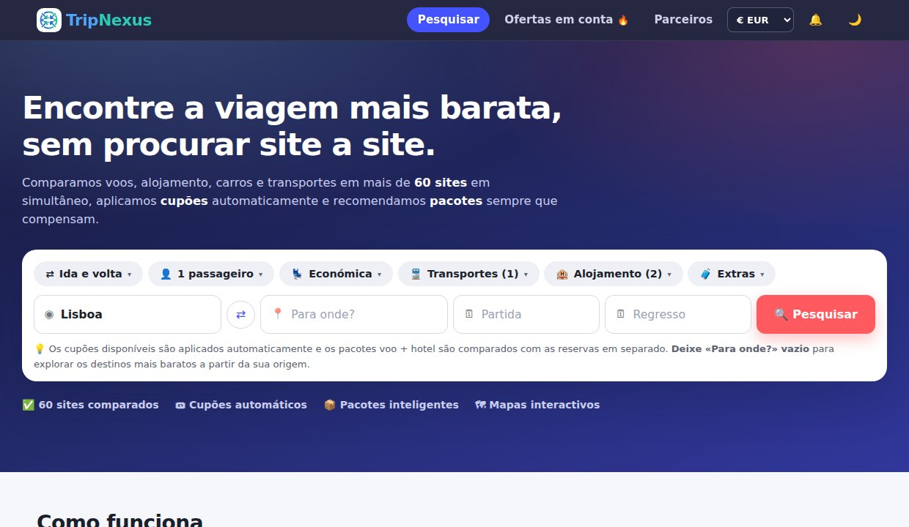
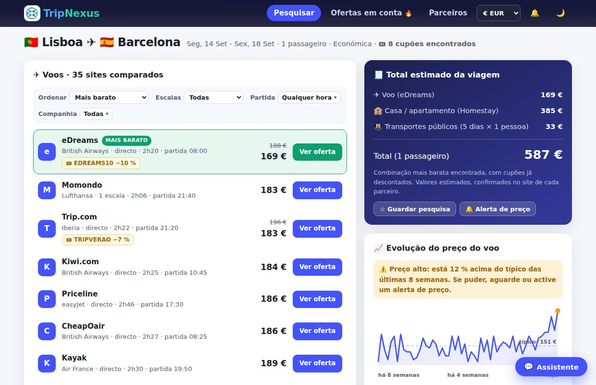
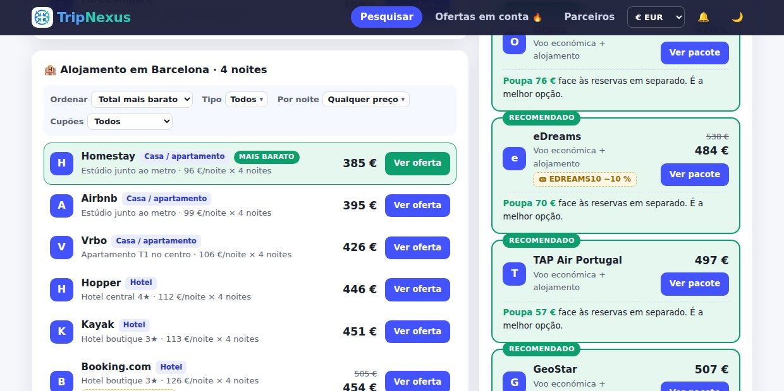
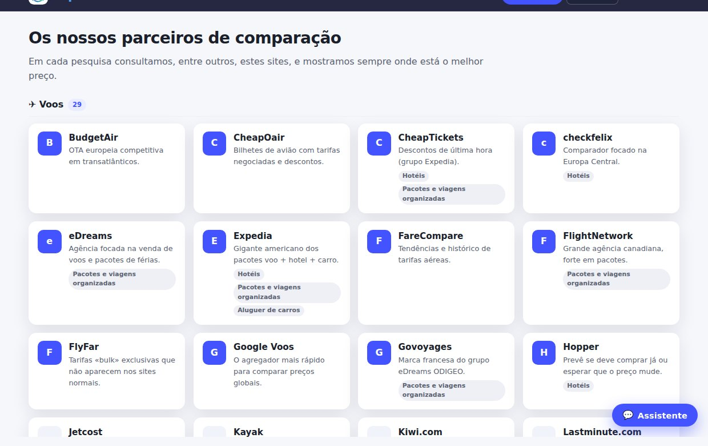
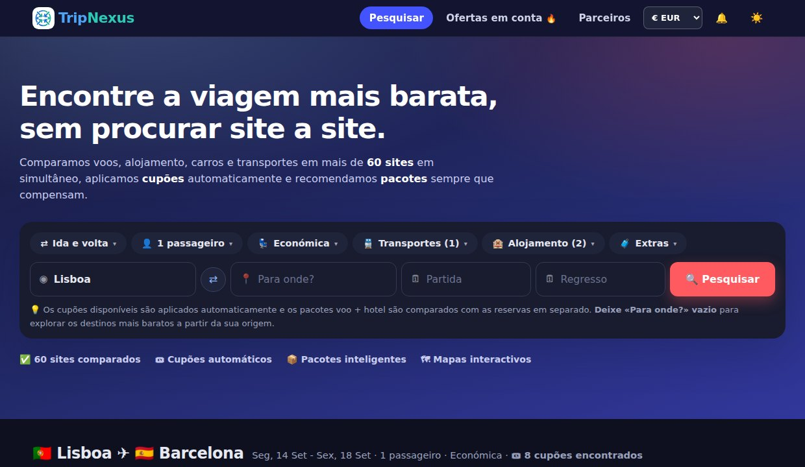
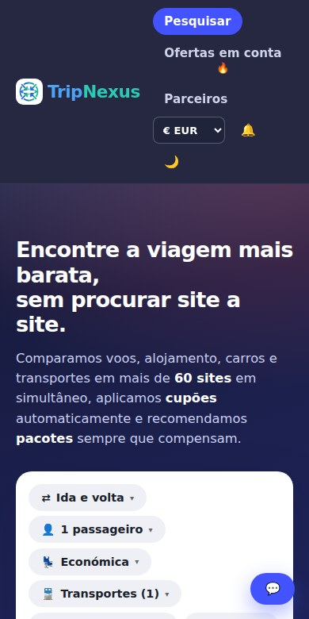

<div align="center">


# TripNexus

**Comparador de viagens em português de Portugal.**
Compara voos, alojamento, carros e transportes em **76 sites parceiros**, aplica cupões
automaticamente e recomenda pacotes sempre que compensam.

[**→ Abrir o site**](https://tripnexus.github.io/) · [Termos](https://tripnexus.github.io/termos.html) · [Privacidade](https://tripnexus.github.io/privacidade.html) · [Afiliação](https://tripnexus.github.io/afiliacao.html)

</div>



---

## O que faz

O TripNexus **não vende viagens**: compara preços e encaminha para o site do parceiro que as
vende. Numa só pesquisa, reúne voos, alojamento, aluguer de viaturas, transportes terrestres e
actividades, calcula o **total da viagem** com os cupões já descontados e diz se um pacote
voo + hotel fica mais barato do que reservar em separado.



De onde vêm os preços:

| Categoria | Origem dos preços |
|---|---|
| ✈ **Voos** | **Reais**, via Aviasales/Travelpayouts (tarifas registadas nas últimas 48 h) |
| 🏨 **Hotéis** | **Reais**, via SerpApi (motor Google Hotels) |
| 🏠 Casas, hostels, carros, transportes, actividades | **Estimativas** deterministas, a partir de distância, época do ano, dia da semana e perfil de cada parceiro |

O preço final é sempre o que constar no site do parceiro no momento da reserva.

---

## Funcionalidades

**Pesquisa**
- Quatro campos («De onde?», «Para onde?», «Partida», «Regresso») com sugestões automáticas de cidades e aeroportos
- **Calendário de preços** ao estilo do Google Voos: dois meses lado a lado, preço por dia e selector de duração
- Opções em painéis: passageiros, tipo de viagem (ida e volta, só ida, várias cidades), classe, transportes, tipos de alojamento e extras
- **Explorar destinos**: deixando «Para onde?» vazio, mostra os destinos mais baratos a partir da origem, em mapa e em cartões

**Resultados**
- Filtros de **escolha múltipla** para voos (companhias, períodos de partida, escalas) e para alojamento (tipo, preço por noite, cupões)
- Total da viagem com cupões descontados e comparação com pacotes
- **Gráfico de evolução do preço**, com veredicto sobre o momento de comprar
- **Roteiro sugerido** por destino, com sítios reais e fotografias da Wikipédia, distribuídos pelos dias da estadia
- Actualização em directo ao mudar qualquer opção



**Assistente de viagens**

Bot de conversação servido por **Cloudflare Workers AI**, em português de Portugal, que responde
sobre destinos, roteiros, melhor altura para viajar e dicas práticas. Está instruído a não
inventar preços nem disponibilidade.


**Parceiros por categoria**



**E ainda**
- Alertas de preço, favoritos e pesquisas recentes (guardados apenas no navegador)
- Selector de moeda (EUR/USD/GBP/BRL) com câmbios ao vivo
- Aba «Ofertas em conta» com destinos bastante abaixo do preço típico
- Aplicação instalável (PWA), com funcionamento offline
- Mapas interactivos (Leaflet) e ícones oficiais dos parceiros

<table>
<tr>
<td width="62%"></td>
<td width="38%"></td>
</tr>
<tr><td align="center"><em>Tema escuro</em></td><td align="center"><em>Telemóvel</em></td></tr>
</table>

Todo o conteúdo está em **português de Portugal, com a ortografia anterior ao Acordo**.

---

## Estrutura

```
index.html               página única (vistas: pesquisa, ofertas, parceiros)
termos.html              termos e condições
privacidade.html         política de privacidade (RGPD)
afiliacao.html           divulgação de afiliação

assets/css/style.css     estilos, incluindo o tema escuro
assets/js/data.js        cidades, parceiros, cupões e ligações de reserva
assets/js/engine.js      motor de estimativas (voos, alojamento, carros, pacotes, cupões)
assets/js/calendar.js    calendário de preços
assets/js/live.js        preços reais de voos e hotéis (via backend)
assets/js/roteiro.js     roteiro sugerido e assistente de viagens
assets/js/alertas.js     alertas de preço, favoritos e pesquisas recentes
assets/js/analytics.js   estatísticas de visitas (Cloudflare Web Analytics, sem cookies)
assets/js/app.js         interface e ligação de tudo

backend/                 Cloudflare Worker: preços reais e assistente (ver backend/README.md)
manifest.webmanifest
sw.js                    aplicação instalável e funcionamento offline (PWA)
```

O site é **estático** e corre no GitHub Pages. O único serviço à parte é um Cloudflare Worker
(plano gratuito) que guarda as chaves de API e serve os preços reais e o assistente. Sem ele
configurado, o site continua a funcionar, com estimativas.

---

## Correr localmente

```bash
git clone https://github.com/TripNexus/tripnexus.github.io.git
cd tripnexus.github.io
python3 -m http.server 8642
```

Depois abrir <http://localhost:8642>. Não há passo de compilação nem dependências: é HTML, CSS
e JavaScript simples.

Para os preços reais e o assistente, ver **[`backend/README.md`](backend/README.md)**.

---

## Acrescentar um parceiro

Basta uma entrada no objecto `PARCEIROS`, em `assets/js/data.js`:

```js
novoParceiro: {
  nome: 'Nome visível',
  dom:  'dominio.com',
  cat:  ['voo', 'hotel'],   // categorias onde aparece
  fx:   1.00,               // factor de preço face à referência
  desc: 'Uma linha a explicar o que tem de especial.'
},
```

Os blocos de resultados e a página de parceiros passam a incluí-lo automaticamente, na
categoria certa. As instruções detalhadas estão comentadas nesse ficheiro.

---

## Privacidade e enquadramento legal

- Sem contas, sem recolha de nome ou e-mail, sem perfis publicitários
- Favoritos, alertas e histórico ficam **apenas no navegador** do utilizador
- Os cookies de afiliação só são carregados **com consentimento explícito** (RGPD/ePrivacy)
- As estatísticas de visitas são **sem cookies** e não seguem o utilizador entre sites
- O site identifica-se claramente como comparador e **não como agência de viagens**

---

<div align="center">
<sub>Projecto pessoal, sem fins comerciais de venda. Os logótipos apresentados pertencem aos respectivos proprietários.</sub>
</div>
